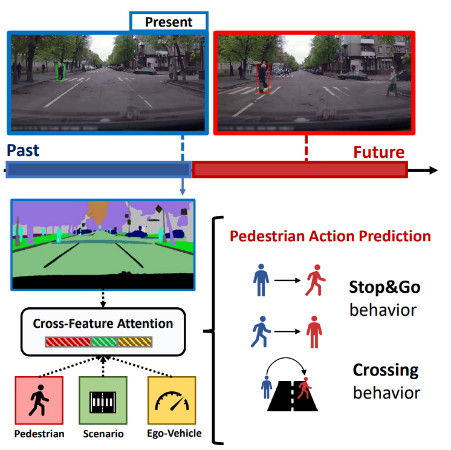

# CrossFeat: Semantic Cross-modal Attention for Pedestrian Behavior Forecasting
Official Pytorch code for the paper "CrossFeat: Semantic Cross-modal Attention for Pedestrian Behavior Forecasting", 

Francesco Marchetti, Taylor Mordan, Federico Becattini, Lorenzo Seidenari, Alberto Del Bimbo, Alexandre Alahi,

IEEE Transactions on Intelligent Vehicles (t-IV).




## Installation
0. To install the required packages, create a conda environment using this command: 
```bash
conda create -n name_env python=3.7
```

1. Pytorch installation:
Then you can install PyTorch 1.9.1 choosing your cude version (this code has been tried with cuda 11):
```bash
pip install torch==1.9.1+cu111 torchvision==0.10.1+cu111 torchaudio==0.9.1 -f https://download.pytorch.org/whl/torch_stable.html
```

2. Install the following libraries: scikit-learn, tqdm, pandas, comet, matplotlib, opencv

3. For using Comet visualization, please specify the dedicated variable in line 39 in train.py.

## Dataset Preparation
0. The project uses the TRANS benchmark, please follow the instruction in <a id='google TRANS'>[TRANS preparation](https://github.com/vita-epfl/pedestrian-transition-dataset)</a>. .

1. Then, download the semantic segmentation generated by Mask2Former from this link <a id='google drive'>[Google Drive](https://drive.google.com/drive/folders/1mpXyRNov-Cw56Ewb5yHMu6Q4BPcY275a?usp=sharing)</a>.
Put the semantic segmentation images in the same folder where are the rgb images.

2. Check the function "define_path" in src/dataset/loader.py to check and set the path to read the images and annotation (line 49 - main_path = 'please/put/your/path/here/')

## Train the Model
To train a model, utilize the script train.py

For example, use this command:
```bash
python train.py
```

## Test the Model
In a pretrained folder, there are the pretrained weights of the models.

To test the model, use this command:
```bash
python eval.py --jaad --mode GO --model_pretrained_path pretrained_models/jaad_go.pt
```

In this case, we are evaluating the model placed in <model_pretrained_path> in <mode> GO on dataset JAAD.
The other commands are in run_eval_models.sh (JAAD/PIE/TITAN and mode STOP/GO).


## Acknowledgment
The code is based on repo "https://github.com/vita-epfl/hybrid-feature-fusion" of paper "Pedestrian Stop and Go Forecasting with Hybrid Feature Fusion" (Dongxu Guo , Taylor Mordan and Alexandre Alahi). 
We thank the authors for making the code available and usable.

This work was supported by the European Commission under European Horizon 2020 Programme, grant number 951911—AI4Media. This work was partially supported by the Piano per lo Sviluppo della Ricerca (PSR 2023) of the University of Siena - project FEATHER: Forecasting and Estimation of Actions and Trajectories for Human-robot intERactions.
